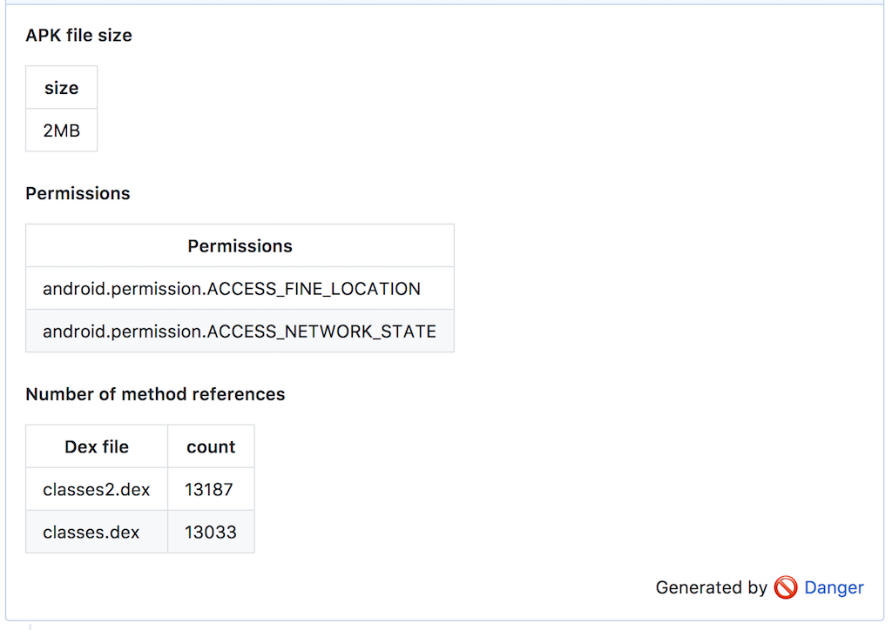

# danger-apkanalyzer

[Danger](http://danger.systems/ruby/) plugin for apkanalyzer.

Run [apkanalyzer](https://developer.android.com/studio/command-line/apkanalyzer.html) and print file size, permissions and number of method refernces.

## Installation

    $ gem install danger-apkanalyzer

## Usage

### Configure

Set APK file path. Create APK file before run danger.

    apkanalyzer.apk_file = "path_to/app.apk"

### Run

Print file size of APK file

	apkanalyzer.file_size

Print permissions used by application

	apkanalyzer.permissions

Print number of method references

	apkanalyzer.method_references

## Sample image

## Development

1. Clone this repo
2. Run `bundle install` to setup dependencies.
3. Run `bundle exec rake spec` to run the tests.
4. Use `bundle exec guard` to automatically have tests run as you make changes.
5. Make your changes.
